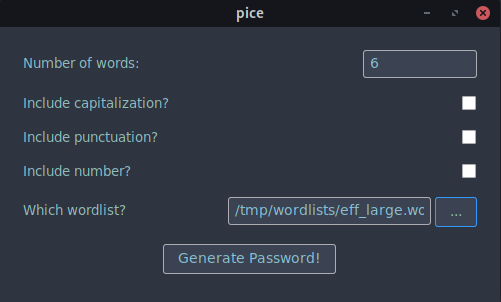

<p align="center">Credits to Jo for the logo!</p>

## Overview
Pice is an offline diceware passphrase generator that offers more flexibility when incorporating punctunations and numbers.  You can choose to provide your own wordlist or used the ones bundled with the binary.

## Installation
Pre-built binaries are provided for the three major platforms: Linux, MacOS, Windows on the [releases](https://github.com/PRust-Projects/pice/releases/latest) page.

### Linux
Download the tar.gz archive for Linux and extract the contents.  To install, first navigate to the directory where you extracted the contents and then:
```bash
$ chmod u+x install.sh
$ sudo ./install.sh
```

### MacOS
Download the tar.gz archive for Darwin and extract the contents.  To install, drag the `pice.app` file to the /Applications folder.  When running, you may be prompted to enter your password and provide permission to run the application since it is coming from an unknown source.  Instructions for unblocking the application may be found [here](https://support.apple.com/guide/mac-help/open-a-mac-app-from-an-unidentified-developer-mh40616/mac).  There are plans to sign the application and progress is being tracked in [issue #4](https://github.com/PRust-Projects/pice/issues/4).

### Windows
Download the zip archive for Windows and extract the contents.  At the moment, a means for installing the application is not provided.  To run it, you can just double click on the application.  Please note the application may be treated as a suspicious threat by your Antivirus as it is not signed.  There are plans to sign the application and progress is being tracked in [issue #3](https://github.com/PRust-Projects/pice/issue/3).

## Screenshots


<br>
*pice running on Manjaro Gnome (Linux)*
